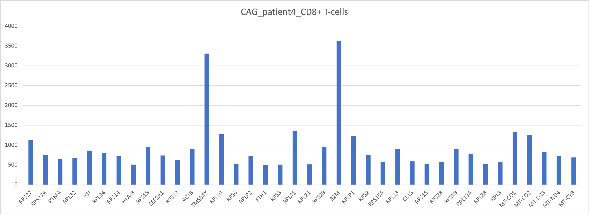

## Introduction
In this tutorial, we perform comparative analysis of different annotation tools for scRNA-seq data. The annotation tools are compared on the basis of their ability to correctly label the celltypes and the respective marker genes. We demonstrate the workflow using gastric cancer dataset throughout the tutorial. The source code is available at [GitHub](https://github.com/meghanakshirsagar/ISCBTutorial23).

### Objective
To design Allele (¨A¨nnotation too¨l¨s for sing¨l¨e c¨e¨ll know¨l¨edgebase cr¨e¨ation), an artificial intelligence driven knowledge graph to reveal novel patterns by mining big data.
Allele in its initial phase has been tested using cypher queries fired on knowledge graph to discover related entities and their properties.    

### Load libraries
Install the relevant R libraries 

```{r library load, message=FALSE, warning=FALSE, results='hide'}
library(Seurat)
library(tidyverse)
library(ggplot2)
library(scCustomize)
library(gridExtra)
library(DESeq2)
library(celldex)
library(ggpubr)
library(SingleR)
library(scMRMA)
library(SeuratWrappers)
library(Nebulosa)
library(dittoSeq)
library(harmony)
library(cowplot)
library(viridis)
library(scuttle)
library(trqwe)
set.seed(1000)
```


### Load Dataset
We will use throughout this vignette, publicly available single-cell RNA-seq dataset provided by [Zhang et al.](https://doi.org/10.1016/j.celrep.2019.04.052). The dataset is available in the Gene Expression Omnibus with Accession Number [GSE134520](https://www.ncbi.nlm.nih.gov/geo/query/acc.cgi?acc=GSE134520). 

In this study, 13 samples of patients diagnosed with gastritis, intestinal metaplasia or early gastric cancer are provided. All the samples are merged together into a Seurat object and it can be downloaded from [here](https://ulcampus-my.sharepoint.com/:u:/g/personal/gauri_vaidya_ul_ie/EWQnJYr_mRVKn9v8c6H1ersBwAOs3Prl7tn6c4huUIgBYg?e=eCOAzF).  


```{r create seurat, results='hide', warning=FALSE}
merged_seurat <- readRDS('gastric_dataset.rds')
```

## Quality Control and Filtering

We will follow the recommendations for quality control and filtering parameters as mentioned by [Zhang et. al](https://doi.org/10.1016/j.celrep.2019.04.052).

```{r qc, results='hide', warning=FALSE}
# get row names of the seurat object
merged_seurat$sample <- rownames(merged_seurat@meta.data)

merged_seurat@meta.data <- separate(merged_seurat@meta.data, col = 'sample', into = c('Patient', 'Barcode'), sep = '__')

# specify patient and type of diagnosis
Patient = c("patient1", "patient2", "patient3", 
            "patient4", "patient5", "patient6"  , "patient7",
            "patient8", "patient9", "patient10",
            "patient11", "patient12", "patient13")

values <- c("NAG", "NAG", "NAG", "CAG", "CAG", "CAG", "IMW", "IMW", "IMS", "IMS", "IMS", "IMS", "EGC")
```


```{r results='hide', warning=FALSE}
# add column in seurat object to specify the type of the patient
merged_seurat$type <- values[match(merged_seurat$Patient, Patient)]

# calculate the percentage of mitochondrial and ribosomal genes

merged_seurat$mitoPercent <- PercentageFeatureSet(merged_seurat, pattern="^MT-")
merged_seurat$riboPercent <- PercentageFeatureSet(merged_seurat, pattern="^RPL")

```

```{r qc2, results='hide', warning=FALSE}
# filter the object
merged_seurat_filtered <- subset(merged_seurat, subset = nFeature_RNA > 400 & nFeature_RNA < 7000 & mitoPercent < 20 & riboPercent < 20)
merged_mnn <- merged_seurat_filtered
```

## Data processing and normalization of the gene expression matrix using Seurat pipeline 

In this section, we pretty much follow [the vignette from Seurat](https://satijalab.org/seurat/archive/v3.1/pbmc3k_tutorial.html) for the preprocessing of the scRNA We perform a standard scRNA-seq normalization and processing: 
1. NormalizeData
2. FindVariableFeatures
3. ScaleData
4. RunPCA
5. RunUMAP

We perform library size normalization by rescaling counts to a common library size of 10000.
```{r, results='hide', warning=FALSE}
merged_unprocessed <- merged_seurat_filtered
merged_seurat_filtered <- NormalizeData(object = merged_seurat_filtered, normalization.method = "LogNormalize", scale.factor = 10000)
merged_seurat_filtered <- FindVariableFeatures(object = merged_seurat_filtered, mean.function = ExpMean, dispersion.function = LogVMR,x.low.cutoff = 0.05, x.high.cutoff = 5, y.cutoff = 0.5, do.plot = T)
merged_seurat_filtered <- ScaleData(merged_seurat_filtered)
merged_seurat_filtered <- RunPCA(merged_seurat_filtered, verbose = FALSE)
merged_seurat_filtered <- RunUMAP(merged_seurat_filtered, dims = 1:20, reduction.name ="UMAP_BatchEffect_Uncorrected")

```
UMAP with batch effects 

```{r warning=FALSE}
dittoDimPlot(merged_seurat_filtered, var="Patient", reduction.use = "UMAP_BatchEffect_Uncorrected", do.label = TRUE) + ggtitle("Batch effects")

```

## Approach 1: Batch correction using Harmony

```{r processing, results='hide', warning=FALSE}
# Library-size normalization, log-transformation, and centering and scaling of gene expression values
merged_harmony <- merged_unprocessed
merged_seurat_filtered <- NormalizeData(object = merged_seurat_filtered, normalization.method = "LogNormalize", scale.factor = 10000)
merged_seurat_filtered <- FindVariableFeatures(object = merged_seurat_filtered, mean.function = ExpMean, dispersion.function = LogVMR,x.low.cutoff = 0.05, x.high.cutoff = 5, y.cutoff = 0.5, do.plot = T)
merged_seurat_filtered <- ScaleData(merged_seurat_filtered)
merged_seurat_filtered <- RunPCA(merged_seurat_filtered, verbose = FALSE)
merged_seurat_filtered <- RunHarmony(merged_seurat_filtered, group.by.vars = "Patient")
merged_seurat_filtered <- RunUMAP(merged_seurat_filtered, reduction = "harmony", dims = 1:20)
dittoDimPlot(merged_seurat_filtered, "Patient", do.label = TRUE) + ggtitle(" ")
```

## Approach 2: Batch correction using MNN

```{r, results='hide', warning=FALSE, echo=FALSE}
merged_mnn <- merged_unprocessed
merged_mnn <- NormalizeData(object = merged_mnn, normalization.method = "LogNormalize", scale.factor = 10000)
merged_mnn <- FindVariableFeatures(object = merged_mnn, mean.function = ExpMean, dispersion.function = LogVMR,x.low.cutoff = 0.05, x.high.cutoff = 5, y.cutoff = 0.5, do.plot = T)
merged_seurat_filtered_mnn <- RunFastMNN(object.list = SplitObject(merged_mnn, split.by = "Patient"))
merged_seurat_filtered_mnn <- RunUMAP(merged_seurat_filtered_mnn, reduction = "mnn", dims = 1:20,  reduction.name = "UMAP_mnnCorrected")

merged_seurat_filtered_mnn <- FindNeighbors(merged_seurat_filtered_mnn, reduction = "mnn", dims = 1:20)

merged_seurat_filtered_mnn <- FindClusters(merged_seurat_filtered_mnn)

dittoDimPlot(merged_seurat_filtered_mnn, "Patient", , reduction.use = "UMAP_mnnCorrected", do.label = TRUE) + ggtitle("Batch correction using MNN")

```
```{r warning=FALSE}
p1 <- dittoDimPlot(merged_seurat_filtered, var = "Patient", 
                   reduction.use = "UMAP_BatchEffect_Uncorrected", size = 0.2) + 
    ggtitle("Patient ID on UMAP before correction")
p2 <- dittoDimPlot(merged_seurat_filtered_mnn, var = "Patient", 
                   reduction.use = "UMAP_mnnCorrected", size = 0.2) + 
    ggtitle("Patient ID on UMAP after correction")

plot_grid(p1, p2)
```


## Cell Type Annotations

scRNA-Seq data can be annotated using two techniques: (1) manual annotation by domain experts, or (2) automated annotation using transcriptomics profiles to assign cell identities. In this tutorial, we compare the pros and cons of each of the approaches. Hence, we choose automated annotation tools such as scMRMA (Marker Gene Database Based in R), SCSA (Marker Gene Database Based in Python) and SingleR (Correlation Based in R).

### Exploring annotation tools

#### Method 1: Annotation with SingleR

We will now annotate the clusters with SingleR, which is an annotation tool combined with Seurat, to explore scRNA-seq data. It is available to be downloaded from [Bioconductor](https://bioconductor.org/packages/release/bioc/html/SingleR.html). SingleR uses a reference dataset of scRNA-seq data with known labels, it labels new cells from a test dataset based on similarity to the reference. We used the reference database, Blueprint/ENCODE consisting of bulk RNA-seq data for pure stroma and immune cells generated by Blueprint [Martens and Stunnenberg 2013](https://doi.org/10.3324/haematol.2013.094243) and ENCODE projects [The ENCODE Project Consortium 2012](https://doi.org/10.1038/nature11247).


```{r echo=TRUE, message=FALSE, warning=FALSE, results='hide'}
seurat.singleR <- merged_seurat_filtered_mnn

# load the BlueprintEncodeData
dataset.ref <- BlueprintEncodeData()

# convert the seurat object to SingleCellExperiment object
seurat.singleR.sce <- as.SingleCellExperiment(seurat.singleR)

# annotate the dataset with SingleR
singleR.labels <- SingleR(test = seurat.singleR.sce ,assay.type.test = 1, ref = dataset.ref, labels = dataset.ref$label.main)

# add column in the main dataset with the annotated labels
seurat.singleR@meta.data$singleR.labels <- singleR.labels$pruned.labels

# change the index of the object to the annotated labels
seurat.singleR <- SetIdent(seurat.singleR, value = "singleR.labels")

# find all the markers with the annotations with minimum log2foldchange of 2 and minimum percentage cells as 50%
all.cluster.markers <- FindAllMarkers(seurat.singleR, logfc.threshold = log2(1.2), min.pct = 0.5)

# export the labelled annotations to csv
write.csv(all.cluster.markers, "ISCBgastric_singleR_labels_mnn.csv")
```


```{r echo=TRUE, message=FALSE, warning=FALSE}
UMAP_singleR <- dittoDimPlot(seurat.singleR, reduction.use = 'UMAP_mnnCorrected', var = 'singleR.labels') + ggtitle("SingleR Annotations") + theme(legend.text = element_text(size = 10), aspect.ratio = 1)

ggarrange(UMAP_singleR)

```
#### Method 2:  Annotation with scMRMA

Another annotation tool that we will discuss in our tutorial is  scMRMA, ‘single cell Multiresolution Marker-based Annotation’ algorithm, which is a bidirectional method that maps cell clusters against a hierarchical reference by [Li et. al](https://academic.oup.com/nar/article/50/2/e7/6396893#327582259). scMRMA uses a reference database, PanglaoDB, with lists of cell-type markers for various tissue types for both human and mouse, which makes it possible to explore cell types with a list of marker genes. Furthermore, it also uses another database, TcellAI containing 22 subcelltypes of T-cells. TcellAI is a part of ImmuCellAI, which was originally collected for cancer immune cells [Miao et. al](https://doi.org/10.1002%2Fadvs.201902880). Therefore, TcellAI is very useful for annotating specific T-cell populations in cancer. In addition, scMRMA accepts user-defined references as well making it a popular choice to be investigated for automated celltype annotation.     


```{r results='hide', warning=FALSE}
merged_seurat_scMRMA <- merged_seurat_filtered_mnn
result <- scMRMA(input = merged_seurat_scMRMA,
                 species = "Hs",
                 db = "panglaodb",
                 p = 0.05,
                 normalizedData = F,
                 selfDB = NULL,
                 selfClusters = NULL,
                 k=20)


merged_seurat_scMRMA[["scMRMA"]] <- result$multiR$annotationResult[colnames(merged_seurat_scMRMA),ncol(result$multiR$annotationResult)]
```

```{r warning=FALSE}
UMAP_scMRMA <- dittoDimPlot(merged_seurat_scMRMA,reduction.use = "UMAP_mnnCorrected",var = "scMRMA")+ ggtitle("scMRMA Annotations") + theme(legend.text = element_text(size = 10), aspect.ratio = 1)
ggarrange(UMAP_scMRMA)
```

```{r results='hide', warning=FALSE}
result <- scMRMA(input = merged_seurat_scMRMA,
                 species = "Hs",
                 db = "TcellAI",
                 p = 0.05,
                 normalizedData = F,
                 selfDB = NULL,
                 selfClusters = NULL,
                 k=20)


merged_seurat_scMRMA[["scMRMA_TcellAI"]] <- result$multiR$annotationResult[colnames(merged_seurat_scMRMA),ncol(result$multiR$annotationResult)]
```

```{r warning=FALSE}
UMAP_scMRMA_tcellAI <- dittoDimPlot(merged_seurat_scMRMA,reduction.use = "UMAP_mnnCorrected",var = "scMRMA_TcellAI", do.label = TRUE)+ ggtitle("scMRMA Annotations with TcellAI") + theme(legend.text = element_text(size = 10), aspect.ratio = 1)
ggarrange(UMAP_scMRMA_tcellAI)
```

#### Method 3:  Annotation with SCSA

SCSA is a python based annotation tool, which annotates the cell types from scRNA-seq data, based on a score annotation model combining differentially expressed genes (DEGs) and confidence levels of cell markers from both known and user-defined information by [Cao et. al](https://www.frontiersin.org/articles/10.3389/fgene.2020.00490/full). SCSA annotation can be directly applied to clustering results obtained from Seurat as well as CellRanger, making it an ideal choice for investigation in this study.

Hence, we will create a .csv file with FindAllMarkers() function and give it as an input to SCSA for annotation containing the cluster results.

```{r results='hide', warning=FALSE}
# prepare data for SCSA annotation in Python
scsa <- merged_seurat_filtered_mnn

# seurat workflow
scsa <- ScaleData(object = scsa)
scsa <- FindNeighbors(scsa, dims = 1:20, reduction = "mnn")
scsa <- FindClusters(scsa)
scsa <- SetIdent(scsa, value="seurat_clusters")
scsa <- FindAllMarkers(scsa,logfc.threshold = log2(1.2), min.pct = 0.5)

# write the results to CSV
write.csv(scsa, 'gastric_scsa.csv')
```


```{python results='hide', warning=FALSE}
import os
os.system("python3 /Users/orphic/Downloads/SCSA-master/SCSA.py -d /Users/orphic/Downloads/SCSA-master/whole.db -s seurat -i /Users/orphic/Downloads/SCSA-master/gastric_scsa.csv -k All -E -g Human -p 0.01 -f 1.5 > results.txt")
```
The results of the annotation from SCSA are saved in your working directory in results.txt file. 

## Introducing Nebulosa

[Nebulosa](https://academic.oup.com/bioinformatics/article/37/16/2485/6103785?login=false), is a R package that uses weighted kernel density estimation to recover signals lost through drop-out or low expression for immune cell types. The marker genes for immune cell types are referenced from [31067475](https://www.ncbi.nlm.nih.gov/geo/query/acc.cgi?acc=GSE134520#:~:text=1947.e5.%20PMID%3A-,31067475,-Zhang%20M%2C%20Feng).

Individual and joint density plots for T cells with Nebulosa.

Here, we also show an example of individual and joint density plots for T cell with Nebulosa for batch corrected seurat object.

```{r warning=FALSE}
tcell <- plot_density(seurat.singleR, c("CD2"), reduction = "UMAP_mnnCorrected") + theme(text = element_text(size = 7))  
tcell + plot_layout(ncol = 1) + theme(text = element_text(size = 7)) 
```
```{r warning=FALSE}
tcell <- plot_density(seurat.singleR, c("CD3D"), reduction = "UMAP_mnnCorrected") + theme(text = element_text(size = 7))  
tcell + plot_layout(ncol = 1) + theme(text = element_text(size = 7)) 
```
```{r warning=FALSE}
tcell <- plot_density(seurat.singleR, c("CD3E"), reduction = "UMAP_mnnCorrected") + theme(text = element_text(size = 7))  
tcell + plot_layout(ncol = 1) + theme(text = element_text(size = 7)) 
```
```{r warning=FALSE}
tcell <- plot_density(seurat.singleR, c("CD3G"), reduction = "UMAP_mnnCorrected") + theme(text = element_text(size = 7))  
tcell + plot_layout(ncol = 1) + theme(text = element_text(size = 7)) 
```
```{r warning=FALSE}
tcell <- plot_density(seurat.singleR, c("CD2", "CD3D", "CD3E", "CD3G"), joint=TRUE, combine=FALSE, reduction = "UMAP_mnnCorrected")  
tcell[[length(tcell)]]
```

## Building Immune Profile

```{r results='hide', warning=FALSE}
seurat.singleR$sampletemp <- paste(seurat.singleR$type, seurat.singleR$Patient, sep="")
seurat.singleR$sample <- paste(seurat.singleR$singleR.labels, seurat.singleR$sampletemp, sep="_")

seurat.singleR$singleR.labels
singlecell <- as.SingleCellExperiment(seurat.singleR)
kids <- purrr::set_names(unique(singlecell$singleR.labels))
kids

# Total number of clusters
nk <- length(kids)
nk

# Named vector of sample names
sids <- purrr::set_names(unique(singlecell$Patient))

# Total number of samples 
ns <- length(sids)
ns

table(singlecell$Patient)

n_cells <- as.numeric(table(singlecell$Patient))

## Determine how to reoder the samples (rows) of the metadata to match the order of sample names in sids vector
m <- match(sids, singlecell$Patient)

## Create the sample level metadata by combining the reordered metadata with the number of cells corresponding to each sample.
ei <- data.frame(colData(singlecell)[m, ], 
                  n_cells, row.names = NULL) %>% 
                select(-"singleR.labels")
ei

groups <- colData(singlecell)[, c("sample")]

pb <- aggregateAcrossCells(singlecell, groups)

df <- assay(pb)

head(df)
```

After bringing in the raw counts data for a particular cell type, we use tools from various packages to wrangle our data to the format needed, followed by aggregation of the raw counts across the single cells to the sample level. The raw counts, a matrix with celltypes in rows and genes in columns, were saved in a csv file "gastric_patientwise.csv". The matrix was transposed and a filter was applied on UMI count for [500, 5000]. Following plots depict the UMI counts for genes in the immune cells for patient4 with NAG. This analysis can be useful to bioinformaticians and domain experts for extracting crucial insights. 




## Summary
The major types of immune cells are lymphocytes (B cells and T cells), Natural killer Cells (NK cells), Dendritic Cells, macrophages, mast cells, monocytes, neutrophils, eosinophils and basophils. They play a crucial role in patient selection in a diverse set of immunotherapies such as cytokine therapy, adoptive cell transfer, immune checkpoint inhibitors (iCI), Cancer vaccine therapies, oncolytic virus therapies.

We covered only T-cell compositions in this tutorial, and we intent to explore in future, other immune cells and their subsets to reveal valuable insights to medical practitioners.


```{r}
sessionInfo()
```

